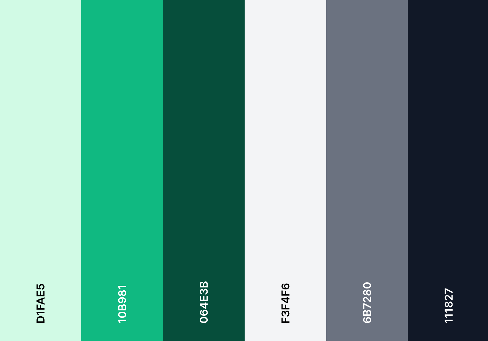

# Together: Cultivating Conversations, Crafting Connections


This web app is powered by the newest bleeding-edge [Next.js v13.4](https://nextjs.org/), delivering an unparalleled experience of speed, performance, and flexibility.

### Exciting Features:

- **Real-Time Messaging:** Stay connected instantly with real-time messaging.
- **Sleek Design:** Enjoy a visually appealing interface with smooth animations.
- **Anywhere, Anytime Access:** Seamlessly use the app on any device.
- **Easy and Secure Authentication:** Hassle-free login with Google or GitHub integration.
- **Effortless Image Sharing:** Share images seamlessly using Cloudinary CDN.
- **Streamlined Form Handling:** Error-free form submissions with validation and error handling.
- **Enhanced Messaging:** Get read receipts and stay informed about active status.
- **Group Chats and One-on-One Messaging:** Connect with multiple people or individuals.
- **Profile Customization:** Personalize your profile and explore settings.

<hr />

## This section is developers only

## Getting Started

First, run the development server:

```bash
npm run dev
# or
yarn dev
# or
pnpm dev
```

Open [http://localhost:3000](http://localhost:3000) with your browser to see the result.

This project uses [`next/font`](https://nextjs.org/docs/basic-features/font-optimization) to automatically optimize and load Inter, a custom Google Font.


## Colour Palette


